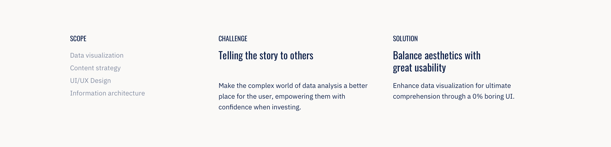
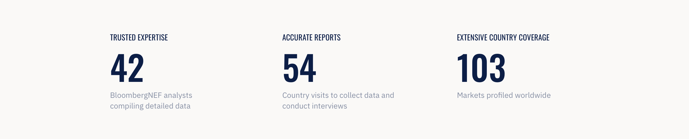
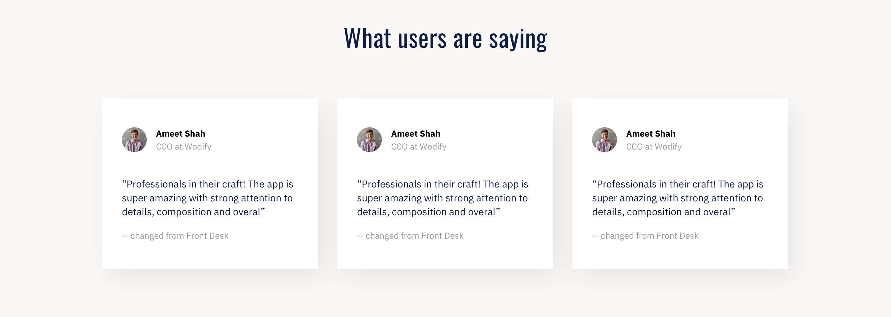

# Case Studies
The case studies are created through markdown files found in `app/_case_studies`.
Each file should be named according to `YYYY-MM-DD-<title>.md` all lowercase with no spaces.

## Base structure
The case studies are defined using only configuration values set through the YAML Front Matter having no content whatsoever.

This is the base structure:
```
---
layout: case-study
permalink: case-studies/<slug>/
theme:
coming_soon:
published:

# Main section
title:
client:
hero:
  bg_color:
  bg_image:
images:
  full:
  small:
  card:

# Into section
s_intro:
  logos: 
    - url:
      alt:
  title:
  description:

# Summary section
s_summary:
  scope:
    - <item>
  challenge:
    title:
    description:
  solution:
    title:
    description:

# Metrics section
s_metrics:
  class:
  items:
    - title:
      description:
      value:

# Featured quote section
s_feature_quote:
  quote:
  source:
  class:
  bgcolor:

# Quotes list section
s_quotes:
  - author:
      name:
      role:
      image: 
        url:
        alt:
    quote:
    source:

# Array of content sections
s_content:
  - type:
    class:
    bgcolor:
    color:
    title:
    content:
    images:
      - url:
        alt:
---
```

Regardless of what order the sections appear in the front matter the will always be rendered in the following order:
- Main section
- Into section
- Summary section
- Array of content sections
- Metrics section
- Featured quote section
- Quotes list section

## YAML Variables
Below is an explanation of all variables with images of how each section is rendered.
All sections are optional with exception of main. If values are not provided, the section is not rendered.

#### Markdown and html support
There are certain variables that support markdown, multi-line text and html. These variables are identified as **Markdown supported**.
To use markdown with this variables you have to use a [literal block scalar](https://yaml-multiline.info/) like so:
```
description: |
  Just add a pipe (|) and then on the next line start writing.
  <strong>Using html is allowed</strong>
  and markdown is **too**.
  But mind the indentation as it is important.
```
Failing to do this will result in the variable being interpreted as plain text.


### Jekyll
```
layout: case-study
permalink: case-studies/<slug>/
theme:
published:
coming_soon:
```
These variables are needed by jekyll.
`layout` will always be `case-study` and the permalink should be unique (The trailing slash is important)
The `theme` variable allows a class to be added to the `body` tag. Leave empty for no class.
`published` controls whether a case study is published. If false, no page is going to be created and it won't show up on the list page.
`coming_soon` is used to show the "Case study coming soon" message on the list page.

### Main

```
title:
client:
hero:
  bg_color:
  bg_image:
images:
  full:
  small:
  card:
```
- `title` (string) is used as the page title everywhere is needed, including cards and in the homepage
- `client` (string) appears as a suptitle
- `images` (object) requires 3 different images for different purposed
- `images.full` (string) is displayed on large screens
- `images.small` (string) is displayed on small screens
- `images.card` (string) is used for the cards on the "Other projects" section
- `hero.bg_color` (string) color to be applied to the hero (applied to `section.cs-hero`)
- `hero.bg_image` (string) image to be applied to the hero (applied to `section.cs-hero`)

### Intro section


All configuration for this section appears under the `s_intro` key.
```
s_intro:
  logos: 
    - url:
      alt:
    - url:
      alt:
  title:
  description:
```
- `logos` (array[object]) represents a list logotypes. Keep adding more items to the list if needed
- `logos[].url` (string) image url
- `logos[].alt` (string) image tag alt text
- `title` (string) section title
- `description` (string) description below the title. Markdown supported.

### Summary section


All configuration for this section appears under the `s_summary` key.
```
s_summary:
  scope:
    - <item>
  challenge:
    title:
    description:
  solution:
    title:
    description:
```
- `scope` (array[string]) list of project scopes
- `scope[]` (string) scope to print. Keep adding more items to the list if needed
- `challenge` (object) data for the challenge column
- `challenge.title` (string) challenge title
- `challenge.description` (string) challenge description below the title. Markdown supported.
- `solution` (object) data for the solution column
- `solution.title` (string) solution title
- `solution.description` (string) solution description below the title. Markdown supported.

### Metrics section


All configuration for this section appears under the `s_metrics` key.
```
s_metrics:
  class:
  items:
    - title:
      description:
      value:
```
- `class` (string) If needed, an additional css class can be added to this section
- `items[]` (array[objects]) list of metrics. Keep adding more items to the list if needed
- `items[].title` (string) metric title
- `items[].description` (string) metric description
- `items[].value` (string) metric value

### Featured Quote section


All configuration for this section appears under the `s_feature_quote` key.
```
s_feature_quote:
  quote:
  source:
  bgcolor:
  class:
```
- `quote` (string) quote to print
- `source` (string) source of the quote
- `bgcolor` (string) background color for the quote block. *Important*: This value must be between quotes
- `class` (string) If needed, an additional css class can be added to this section

### Quotes section


All configuration for this section appears under the `s_quotes` key.
```
s_quotes:
  - author:
      name:
      role:
      image: 
        url:
        alt:
    quote:
    source:
```
- `[]` (array[objects]) list of quotes. Keep adding more items to the list if needed
- `[].author` (object) data about the quote author
- `[].author.name` (object) name of the quote author
- `[].author.role` (object) role of the quote author
- `[].author.image` (object) data about the image
- `[].author.image.url` (string) image url
- `[].author.image.alt` (string) image tag alt text
- `[].quote` (string) quote to print
- `[].source` (string) source of the quote

### Content sections
The content sections are defined in a list and despite using the same variables, the rendered result will vary according to its `type`.

The configuration for content section appears under the `s_content` key as a list:
```
s_content:
  - <item>
```

#### Column sections
There are 4 types of column sections that are named according to how the text is displayed.
- `section-tl` - Text displayed on the left
- `section-tr` - Text displayed on the right
- `section-tl-small` - Text displayed on the left in a small variant
- `section-tr-small` - Text displayed on the right in a small variant

There are additional variations to those types of sections with a full colored background. If the variable `bgcolor` is defined the section will automatically switch to this variation.

TODO: Add example images

The variables for these sections are:
```
s_content:
  - type:
    title:
    content:
    images:
      - url:
        alt:
    bgcolor:
    class:
    color:
```
- `type` (string) type of the section as listed above
- `title` (string) title of the section
- `content` (string) content for the section. Markdown supported
- `images` (array[object]) list of images. Keep adding more items to the list if needed
- `image[].url` (string) image url
- `image[].alt` (string) image tag alt text
- `bgcolor` (string) background color for the section block. *Important*: This value must be between quotes
- `class` (string) If needed, an additional css class can be added to this section
- `color` (string) Text color for the section. Any css color is supported

#### Image sections
There are 2 types of image sections:
- `section-img` - image displayed with content width
- `section-img-full` - image display with full viewport width

TODO: Add example images

The variables for these sections are:
```
s_content:
  - type:
    images:
      - url:
        alt:
    class:
```
- `type` (string) type of the section as listed above
- `images` (array[object]) list of images. Keep adding more items to the list if needed
- `image[].url` (string) image url
- `image[].alt` (string) image tag alt text
- `class` (string) If needed, an additional css class can be added to this section

#### Escape hatch section
There's a special section type `section-esc-hatch` that can be used as an escape hatch, to print whatever is found in the `content` variable without any wrappers.
This shouldn't be used unless there's no other solution.
```
s_content:
  - type:
    content:
```
- `type` (string) section-esc-hatch
- `content` (string) content that is printed. Markdown supported